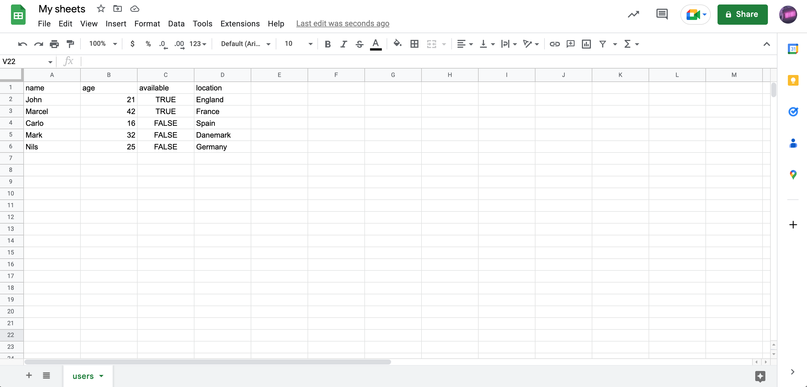
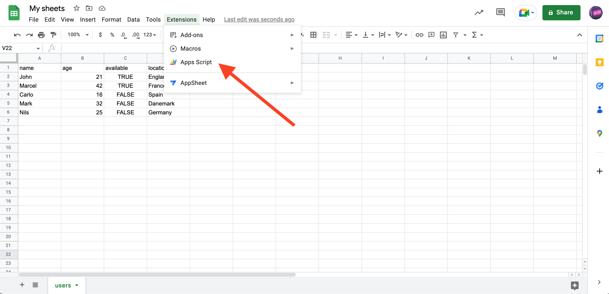
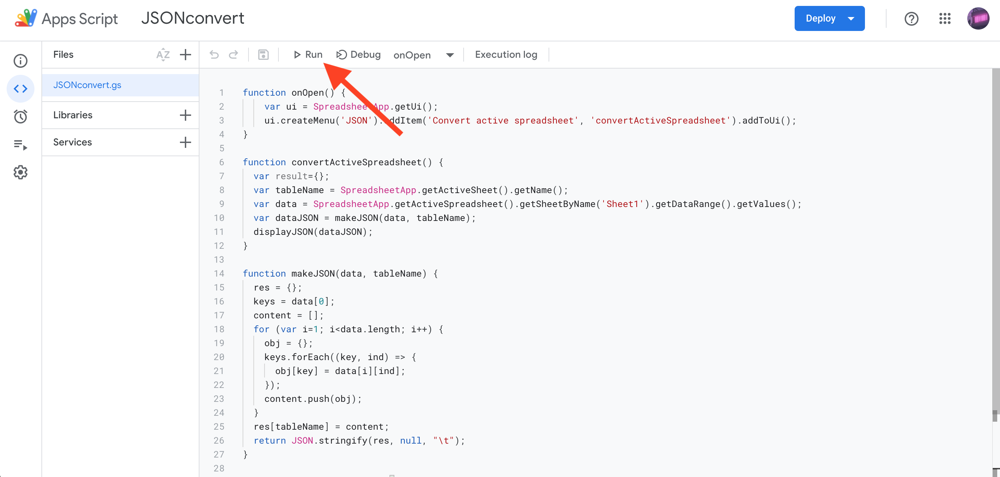

# Apps Script convert Google Sheets to JSON

## How to use ?
1. Fill your sheet with you desired data
The first row indicates the propreties keys and the following rows the values, as in the example.

*Example*

 

2. Add the extension
Go to **Extensions -> Apps Script** then **Add File** and copy the code from `JSONconvert.js` in it.
Now press **Run** and return to your spreadsheet.

*Add the extension*

 

3. Convert your data
Select the **JSON** menu from the menu bar and the **Convert active spreadsheet**.
*NOTE :* The result will be an object named afer your spreadsheet name with the array of objects from you sheet.

*Run the script*

 

Feel free to share your issues/improvements.